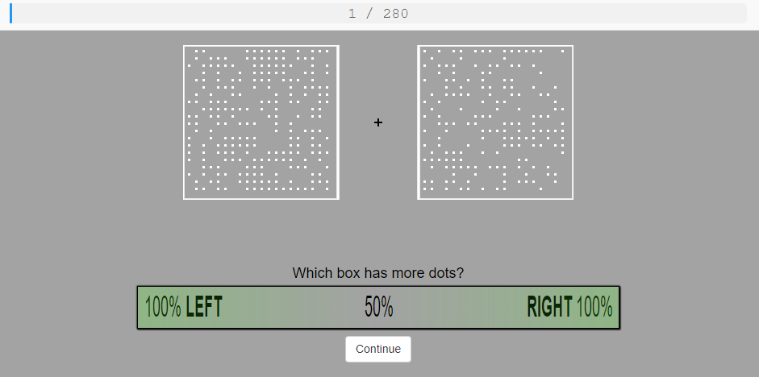

December 2018  
[Script run `r Sys.time()`]

```{r setup, include=FALSE}
knitr::opts_chunk$set(echo = F)
startTime <- Sys.time()
source('src/ESM_core.R')
```

# Descriptives 

## Introduction 

Participants performed a perceptual discrimination task in which they had to identify which of two boxes contained the most dots. Stimuli were presented for a brief time.

<div style="display: flex; justify-content: space-between">
  <div style="text-align: center"><br/>
      The Dot Task
  </div>
</div>

## Load data  

```{r}
folderName <- "G:\\Documents\\University\\Google Drive\\Temp\\data\\processed"

results <- loadFilesFromFolder(folderName)
results <- removeParticipantIds(results)

# folderName <- 'ESM_sim.R'
# source('src/ESM_sim.R')
# results <- simulateAdvisorChoice(16, aPairs = list('agr' = c(7,8)), tTypes = c(trialTypes$dual, trialTypes$change))

# unpack results
for(i in 1:length(results))
  assign(names(results)[i], results[i][[1]])

cat(paste('Loaded data from', folderName))
```

```{r}
trials <- cbind(trials, trialUtilityVariables(results))
all.trials <- trials
trials <- trials[trials$practice == F, ]
cat('Generated utility variables')
```

## Metadata

Responses (`r paste('*N* =', length(unique(participants$pid)))`) were collected between `r as.POSIXct(min(unlist(participants$timeStart))/1000, tz = '', origin = '1970-01-01')` and `r as.POSIXct(max(unlist(participants$timeEnd))/1000, tz = '', origin = '1970-01-01')`.

Demographic data are not collected and therefore not analysed. Participants must be over 18 years old to use the Prolific recruitment platform.

# Exclusions

```{r}
participants$excluded <- sapply(participants$pid, function(pid){
  ts <- all.trials[all.trials$pid == pid,]
  # overall accuracy of initial decisions
  m <- mean(ts$initialCorrect, na.rm = T)
  if(m < .65 | m > .85) return('Accuracy')
  # varied use of confidence scale
  cCs <- aggregate(pid ~ confidenceCategory, data = ts, FUN = length)
  # All confidence categories must be used
  if(nrow(cCs) < 3) return ('Confident')
  # All confidence categories must have at least 5% of the number of trials
  if(any(cCs$pid < length(ts)*.05)) return('<5%')
  return(F)
  })
# exclude on the basis of collecting too much data
if(sum(participants$excluded == F) > 50) {
  tmp <- participants[participants$excluded == F, c('id', 'timeStart')]
  tmp <- tmp$id[order(tmp$timeStart)]
  tmp <- tmp[1:50]
  participants$excluded[!(participants$id %in% tmp)] <- 'Excess'
}
```

We exclude participants for:

* Proportion of correct initial judgements must be (.65 < cor1/n < .85) (*N* = `r sum(participants$excluded == 'Accuracy')`)

* Having fewer than 3 confidence categories (*N* = `r sum(participants$excluded == 'Confident')`)

* Having fewer than 5% of trials in each confidence category (*N* = `r sum(participants$excluded == '<5%')`)

* There being more data collected than specified in pre-registration (*N* = `r sum(participants$excluded == 'Excess')`)

*NB: **practice trials are included** in this since they are used in part for determining confidence calibration*

The number of participants analysed after exclusions (total *N* = `r sum(participants$excluded != F)`) have taken place is `r sum(participants$excluded == F)`.

```{r}
# Perform exclusions
participants <- participants[participants$excluded==F, ]
# Remove excluded participants' data from other data frames
all.trials <- all.trials[all.trials$pid %in% participants$pid, ]
trials <- trials[trials$pid %in% participants$pid, ]
advisors <- advisors[advisors$pid %in% participants$pid, ]
questionnaires <- questionnaires[questionnaires$pid %in% participants$pid, ]
genTrustQ <- genTrustQ[genTrustQ$pid %in% participants$pid, ]
```

# Comparisons

## Type 1 performance

Participants' performance was held at 71% by design. Participants' mean percentage correct  was `r md.mean(aggregate(initialCorrect ~ pid, trials, mean)$initialCorrect, isProportion = T)`. 

Type 1 performance should not differ as a function of repetition. This is checked by comparing the performance on the first appearance of repeated trials against performance on the repetitions.

```{r results = 'asis'}
tmp <- trials[trials$isRepeat | trials$isRepeated, ]
novel <- aggregate(initialCorrect ~ pid, data = tmp[!tmp$isRepeat, ], FUN = mean)
repeated <- aggregate(initialCorrect ~ pid, data = tmp[tmp$isRepeat, ], FUN = mean)
md.ttestBF(novel$initialCorrect, repeated$initialCorrect, labels = c('*M*|novel', '*M*|repeat'), paired = T)
```

If there are differences, these may be due to:

* (implicit) memory effects  

* a tendency for repeated trials to be easier due to the trimming process


Some trials have their grids switch side when repeated. Insofar as there is a difference in the original and repeated presentations, this difference should be attenuated by switching sides. This is tested by calculating a delta value for each repetition (1 = rep correct, original wrong; 0 = same accuracy; -1 = rep wrong, original correct), and testing the mean deltas by swapped status.

```{r results = 'asis'}
tmp <- trials[trials$isRepeat | trials$isRepeated, ]
tmp$swapped <- sapply(1:nrow(tmp), function(i) {
  if(!tmp$isRepeat[i]) return(F)
  return(tmp$grid[i] != tmp$grid[tmp$id == tmp$stimulusParent[i] & tmp$pid == tmp$pid[i]])
})

tmp$delta <- sapply(1:nrow(tmp), function(i) {
  if(!tmp$isRepeat[i]) return(NA)
  x <- tmp$initialCorrect[tmp$id == tmp$stimulusParent[i] & tmp$pid == tmp$pid[i]]
  tmp$initialCorrect[i] - x
})
  
data <- aggregate(delta ~ pid + swapped, data = tmp[tmp$isRepeat, ], FUN = mean)

md.ttestBF(data$delta[!data$swapped], data$delta[data$swapped], labels = c('*M*|same', '*M*|swapped'), paired = T)
```

## Type 2 performance

Type 2 (metacognitive) performance is characterised using Type 2 ROC. The mean ROC for all participants is tabulated below:

```{r results = 'asis'}
tmp <- trials[trials$isRepeat | trials$isRepeated, ]

df.type2 <- NULL
for(p in unique(trials$pid)) {
  for(x in c(T, F)) {
    ts <- tmp[tmp$isRepeat == x & tmp$pid == p, c('initialCorrect', 'initialConfidence')]
    ts <- ts[!is.na(ts$initialConfidence) & !is.na(ts$initialCorrect), ]
    if(nrow(ts) == 0)
      next()
    roc <- type2ROC(ts[ ,1], ts[ ,2], bins = 7)
    df.type2 <- rbind(df.type2, data.frame(pid = factor(p), isRep = !x, conf = roc$x, pCorrect = roc$y))
  }
}
tmp <- seq(0, 1, length.out = length(unique(df.type2$conf))+1)
tmp <- sapply(1:(length(tmp)-1), function(i) mean(c(tmp[i], tmp[i+1])))
df.type2$confProp <- sapply(df.type2$conf, function(x) tmp[which(levels(df.type2$conf) == x)])

tmp <- aggregate(pCorrect ~ conf + isRep, df.type2, mean)
# print neatly with rounding
tmp[ ,3] <- prop2str(tmp[ ,3])
kable(prop2str(tmp))
```

Participants' ROC curves:

```{r}
ggplot(df.type2, aes(x = confProp, y = pCorrect, colour = pid)) +
  geom_abline(slope = 1, intercept = c(0,0), linetype = 'dashed', colour = 'black') +
  geom_point() +
  geom_line(aes(group = pid)) +
  facet_wrap(~isRep, labeller = label_both) +
  scale_x_continuous(limits = c(0,1)) +
  scale_y_continuous(limits = c(0,1)) +
  coord_fixed() +
  style.long +
  theme(panel.spacing.x = unit(1, 'lines'))
```


# Exploration 

## Recognition test

Participants are given 5 grids and asked to select those which they recognise from the experiment. One of the grids comes from the previous block ('repeat'), and one is from the previous block but with the left and right grids switched ('swapped'). We examine the relative picking frequencies for each of these grids compared to novel grids ('new'). This is exploratory because it cannot be guaranteed that novel grids aren't swaps of earlier grids, or how many times repeats have been seen before (1 or 2).

```{r}
# Correct for incidental repeats
debriefRepQuiz$actualRepeat <- NA
debriefRepQuiz$actualType <- NA
for(pid in unique(debriefRepQuiz$pid)) {
  tmp <- debriefRepQuiz[debriefRepQuiz$pid == pid, ]
  tmp$actualRepeat <- tmp$grid %in% trials$grid[trials$pid == pid]
  tmp$actualType[tmp$actualRepeat] <- 'repeat'
  tmp$actualType[!tmp$actualRepeat] <- tmp$type[!tmp$actualRepeat]
  debriefRepQuiz[debriefRepQuiz$pid == pid, ] <- tmp
}

df.dotQuiz <- aggregate(selected ~ pid + actualType, debriefRepQuiz, mean)

ggplot(df.dotQuiz, aes(x = actualType, y = selected)) +
  geom_violin(colour = NA, fill='grey75', alpha = .5) +
  geom_point(aes(colour = factor(pid)), position = position_jitter(.1)) +
  stat_summary(geom = 'errorbar', fun.data = mean_cl_normal, width = .25) +
  stat_summary(geom = 'point', fun.y = mean, size = 3, shape = 18) +
  scale_x_discrete(name = 'Grid type') +
  scale_y_continuous(name = 'P(selected)', limits = c(0,1)) +
  style.long

```

Overall, participants selected `r round(mean(debriefRepQuiz$selected)*length(unique(debriefRepQuiz$id)),2)` responses on each quiz.

# Credits 

## Acknowledgements

Thanks as always to Nick Yeung and the other folks at the [ACC Lab](https://www.psy.ox.ac.uk/research/attention-cognitive-control-lab).

## R Packages

```{r results = 'asis'}
# list packages
packageNames <- (.packages())
# don't include very core package
packageNames <- packageNames[!(packageNames %in% rownames(installed.packages(priority="base")))]
# but do include the base package
packageNames <- c("base", packageNames)
out <- NULL
for(p in packageNames) {
  out <- rbind(out, data.frame('Package' = p, 
                               'Citations' = paste(format(citation(p), style = 'textVersion'), 
                                                   collapse = '<br/><br/>')))
}

kable(out)
```

## Funding

Matt Jaquiery is funded by a studentship from the [Medical Research Council](https://mrc.ukri.org/) (reference 1943590) and the University of Oxford [Department of Experimental Psychology](https://www.psy.ox.ac.uk/) (reference 17/18_MSD_661552).

## Technical details  

```{r results = 'hold'}
cat(paste('Time stamp:', Sys.time(), '\n\n'))
cat('Runtime \n')
proc.time()
cat('\n')
sessionInfo()
```